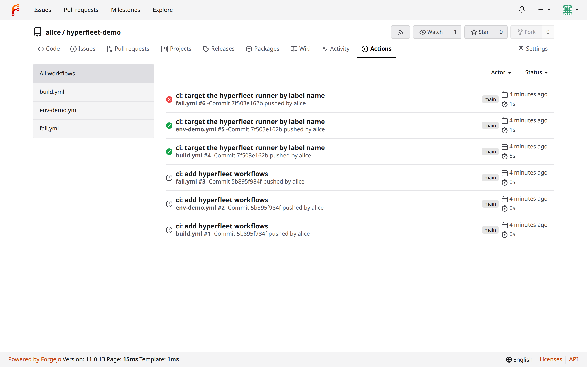
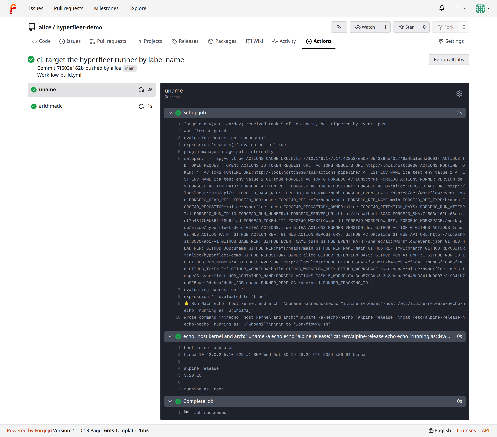
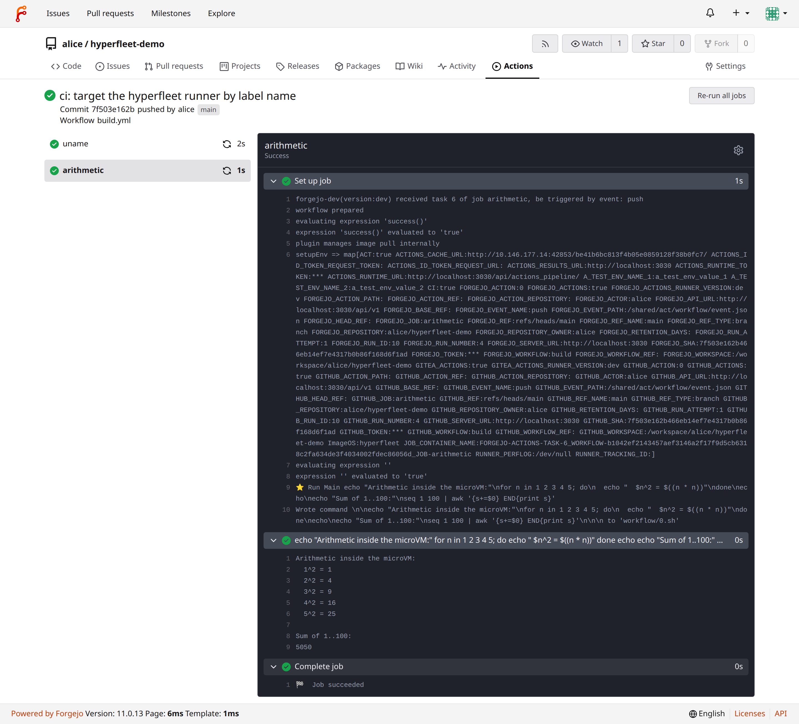
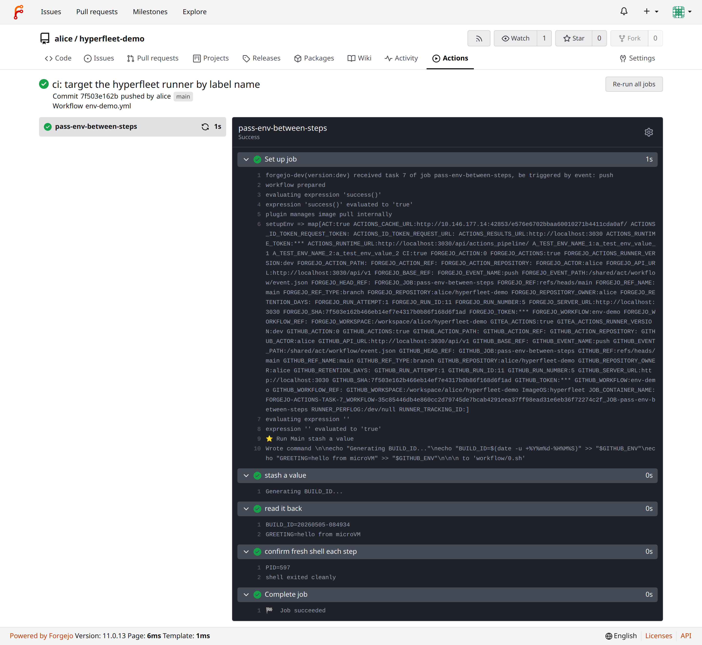
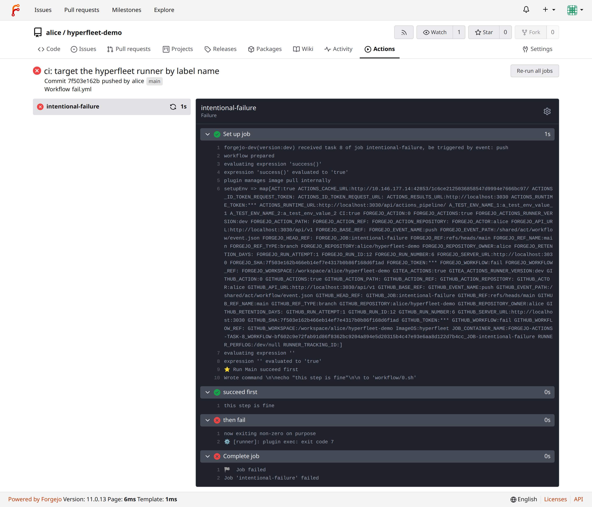

# hyperfleet-forgejo-plugin

A [Forgejo Runner v2 backend plugin](https://code.forgejo.org/forgejo/forgejo-actions-feature-requests/issues/107)
that runs CI jobs inside [hyperfleet](https://github.com/alexisbchz/hyperfleet)
microVMs.

```
forgejo-runner ── go-plugin ──> hyperfleet-forgejo-plugin ── HTTP ──> hyperfleet daemon ── vsock ──> in-guest initd
```



The runner launches the plugin as a subprocess via
[hashicorp/go-plugin](https://github.com/hashicorp/go-plugin); each
`pluginv1.BackendPlugin` RPC translates into one or more HTTP calls against
a hyperfleet daemon's REST API:

| RPC | HTTP |
|---|---|
| `Capabilities` | (in-process) |
| `Create` | `POST /machines` then poll `GET /machines/{id}` until `running` |
| `Start` | wait on `GET /machines/{id}/healthz` |
| `Exec` | `POST /machines/{id}/exec`, framed stream → `ExecOutput` |
| `CopyIn` | `PUT /machines/{id}/files?path=...` |
| `CopyLocal` | tar src on host, then `PUT /files` |
| `CopyOut` | `GET /machines/{id}/files?path=...` |
| `UpdateEnv` | `GET /files` of `$GITHUB_ENV`, parse `K=V` |
| `IsHealthy` | `GET /machines/{id}/healthz` |
| `Remove` | `DELETE /machines/{id}` |

The plugin advertises:

- `manages_own_networking: true`
- `supports_local_copy: true`
- `supports_docker_actions: false`
- `supports_service_containers: false`

## Building

The plugin contract isn't in upstream
`code.forgejo.org/forgejo/runner/v12@latest` yet — it lives on a fork. The
`go.mod` replace directive points at `./.deps/forgejo-runner`, so clone the
fork into that path before building:

```sh
git clone https://git.erwanleboucher.dev/eleboucher/runner .deps/forgejo-runner
go build -o bin/hyperfleet-forgejo-plugin .
```

Once the plugin contract lands in upstream Forgejo Runner, the `replace`
directive in `go.mod` can be deleted.

## Configuring a runner

Add a `pluginsv2` entry in your runner's `config.yaml` and start the runner
with the daemon's URL and API key in the environment:

```yaml
pluginsv2:
  hyperfleet:
    path: /path/to/bin/hyperfleet-forgejo-plugin
    options: {}
```

```sh
export HYPERFLEET_API_URL=http://localhost:8080
export HYPERFLEET_API_KEY=<api-key>
forgejo-runner --config config.yaml daemon
```

Register the runner with a label whose name matches the plugin name and
whose schema-arg encodes the OCI image to boot:

```sh
forgejo-runner --config config.yaml register \
  --instance http://forgejo.example.com \
  --token <registration-token> \
  --name my-hyperfleet-runner \
  --labels "hyperfleet:hyperfleet://docker.io/library/alpine:3.20" \
  --no-interactive
```

## Targeting it from a workflow

```yaml
# .forgejo/workflows/hello.yml
on: [push]
jobs:
  greet:
    runs-on: hyperfleet:hyperfleet://docker.io/library/alpine:3.20
    steps:
      - name: print system info
        run: |
          uname -a
          cat /etc/alpine-release
```

The runner's label parser decomposes `runs-on` into `(name, schema, arg)`:
the **name** picks the plugin (must match a `pluginsv2:` key); the **arg**
is forwarded as `BackendOptions["label_arg"]` and the plugin uses it as
the OCI image reference. A workflow with a `container:` block overrides
this and the plugin uses `CreateRequest.Image` instead.

## Configuration

| env var | default | meaning |
|---|---|---|
| `HYPERFLEET_API_URL` | `http://localhost:8080` | hyperfleet daemon base URL |
| `HYPERFLEET_API_KEY` | — | sent as `X-API-Key` |

The plugin does no per-VM bookkeeping of its own: hyperfleet's daemon owns
the machine map, and the daemon's machine ID is the `environment_id`
returned to the runner. That means killing the plugin process never leaves
hyperfleet in an inconsistent state — `forgejo-runner` will simply launch a
fresh subprocess on the next job.

## End-to-end demo

The screenshots in [`docs/screenshots/`](docs/screenshots) come from a
local run of three workflows in `alice/hyperfleet-demo` covering parallel
jobs, `$GITHUB_ENV` round-trip, and intentional non-zero exit.

### Real microVM output streamed back to Forgejo

`uname -a` from inside the guest, with the microVM's IP and the kernel
that boots it:



A second job in the same workflow does loop arithmetic and pipes
`seq 1 100` through `awk` — the `5050` lands in Forgejo's log pane:



### `$GITHUB_ENV` round-trip

Step 1 appends `BUILD_ID=…` to `$GITHUB_ENV`; step 2 reads it back. The
plugin's `UpdateEnv` RPC pulls the file out of the guest via
`GET /files`, parses `K=V`, and feeds the map into the next step's
environment.



### Exit-code propagation

A step ending in `exit 7` shows the framed protocol carrying an int32
exit code out of the guest, through the daemon, and into a red ❌ in the
UI:



## Tests

Unit tests:

```sh
go test ./...
```

End-to-end test (skipped unless `HYPERFLEET_E2E=1`; needs a running
hyperfleet daemon and `bin/hyperfleet-init` baked into the rootfs):

```sh
HYPERFLEET_E2E=1 \
  HYPERFLEET_API_URL=http://localhost:8080 \
  HYPERFLEET_API_KEY=<key> \
  HYPERFLEET_PLUGIN_BIN=$(pwd)/bin/hyperfleet-forgejo-plugin \
  go test -v -count=1 -run TestEndToEnd .
```

The e2e drives the plugin through the runner SDK and checks the full
`Capabilities → Create → Start → Exec → Copy → Exec → IsHealthy → Remove`
cycle, including stdout/stderr separation, non-zero exit codes, and that
`Remove` actually frees the daemon-side machine.

## License

[AGPL-3.0](LICENSE)
